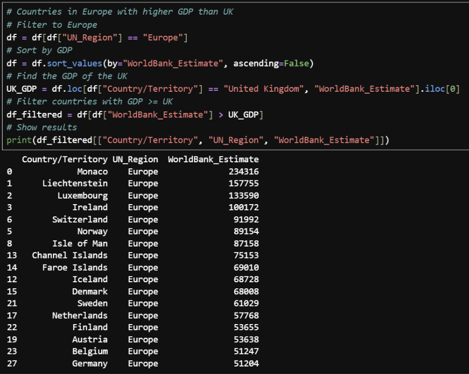
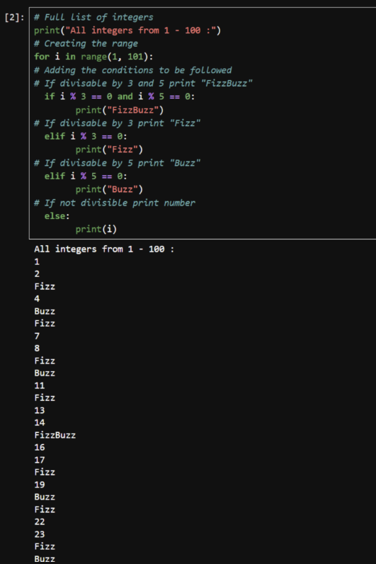

# Introduction to Python
Initially with python simple processes were shown first basic print, else, head etc... which were then built upon. 
This included importing dataframes using pandas, getting info from a dataframe, indexing and slicing, data manipulation and grouping.
While learning these features the skills learnt were applied to the workbook which started fairly basic but built over time to be more complex code.
The examples are shown below.

The first example shows the dataframe being filtered and manipulated to find the European countries with a higher GDP than the UK.

The second example shows a large dataframe being filtered and manipulated to find the average GDP and display all countries with a lower GDP.

The next example shows a dataframe manipulated to split a table to show both boys and girls seperated by class and sorted by which class has the highest grade.

The final example shows a fun script to take every integer from 0-100 and assign it a value based on if its divisible by 3, 5 or both.

